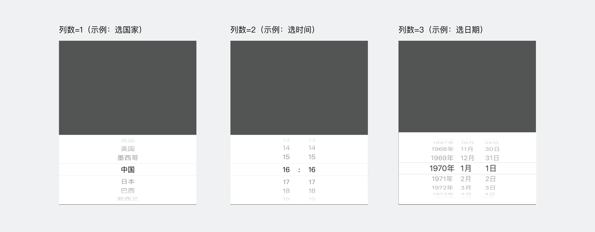
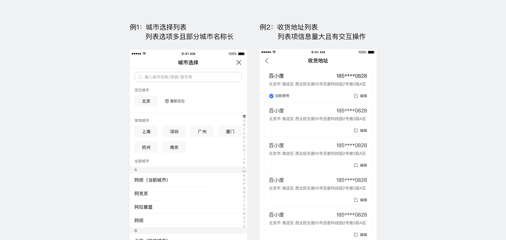

选项控件
--------------
<notice>允许用户对选项进行选择</notice>

选择控件允许用户选择某个值，这个值通常是选中/非选中，开/关。
通常搭配列表使用，点击时组件状态在选中/非选中，开/关间切换。

连续滑块条
--------------
<notice>允许用户通过滑动交互，完成一系列选项中的选择</notice>

滑块选择条允许用户从一个范围内选择某个值，这个值通常是主观的、不精准的设置，如亮度等。
滑动时，设置滑块跟随手势，实时反馈，松手即刻生效设置，且页面需要有相应的交互反馈当前状态。

浮层选择器
--------------
<notice>用于承载选项较多的列表</notice>

浮层选择器通常在底部显示，并固定高度展现。当列数不唯一时，用户在前列选择会对后列选项会产生约束和影响。
自定义配置：
1.选项列数（1-3列），各列选项内容；
2.用于时间选择场景时，可配置日期（年月日），时间（分秒）。

全屏选择器
--------------
<notice>用于承载选项特别多的列表</notice>

以下场景更适合全屏选择器：
1.选项特别多时，筛选成本高
2.列表选项较长
3.列表选项信息量较多
4.带交互操作（如搜索、编辑等）
