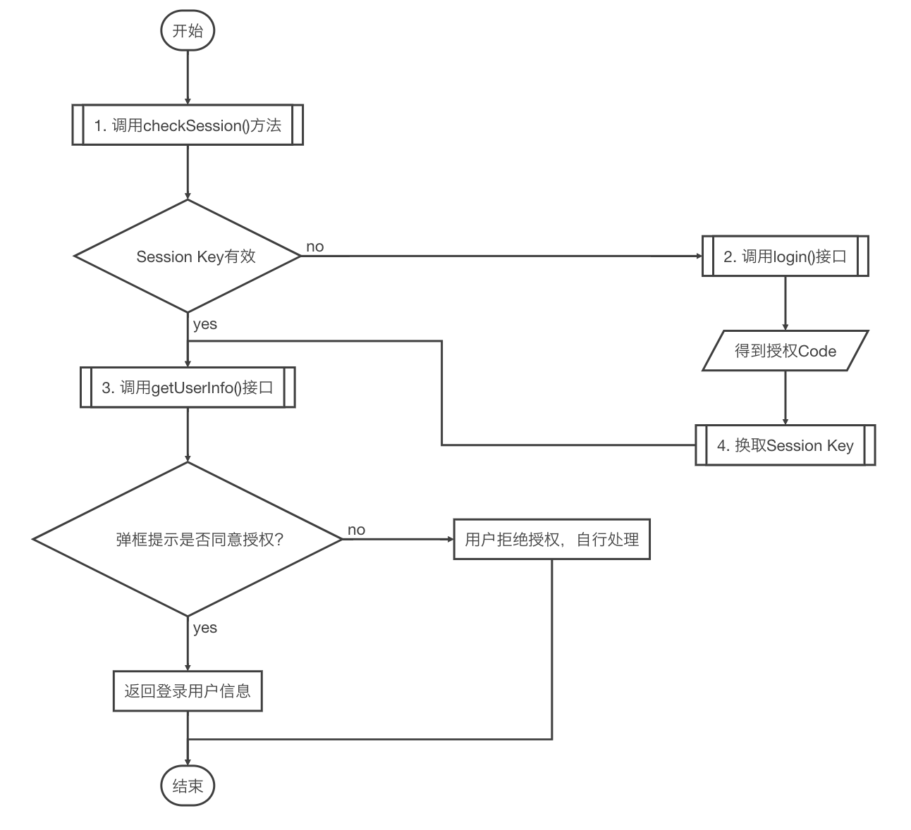

## 流程示意图

以下是智能小程序使用OAuth 2.0进行授权及获取用户信息的示意图。

## 相关概念

OAuth 2.0（开放授权）：一个开放登录授权标准。用户授权后，第三方智能小程序无需获取用户的用户名和密码就可以访问该用户。

Session Key：用户对智能小程序的授权会话的密钥。用户授权后，开发者可以通过百度开放平台获取授权会话的Session Key，此后便可在智能小程序中获取用户信息。

Code：用户授权的标识。在用户完成对应用的授权后，会生成一个很短时间（十分钟）内有效的授权标识，开发者通过服务端请求，将code以及智能小程序的client\_id和secret\_key传到开放平台接口，可以获取到SessionKey。

## 使用百度授权前准备

您需要创建一个智能小程序以获取client\_id（AppKey）和client\_secret（AppSecret），以上两者均从智能小程序开发者后台查看。

## 智能小程序在App内部运行时的授权流程

智能小程序在App内部运行时采用Authorization Code获取SessionKey的授权验证。

对于智能小程序而言，其流程由获取Authorization Code，和通过Authorization Code获取Session Key这2步组成。

### 第一步：获取Authorization Code

智能小程序可以使用`swan.login()`接口获取Authorization Code。

### 第二步：通过 Authorization Code 获取 Session Key

智能小程序在其服务端中发送POST请求到百度 OAuth2.0 授权服务地址，并带上对应的参数，便可获取到Session Key。

**获取Session Key的URL地址：**

https://openapi.baidu.com/nalogin/getSessionKeyByCode

**获取Session Key需要的参数：**

| 参数名 | 是否必须 | 说明 |
| ----- | ------ | --- |
| code | 是 | 通过上面第一步所获得的Authorization Code |
| client_id | 是 | 智能小程序的App Key |
| sk | 是 | 智能小程序的App Secret |

若参数无误，服务器将返回一段JSON文本，包含以下数据：

| 字段名 | 说明 |
| ------| --- |
| session_key | 用户的Session Key |

若请求错误，服务器将返回一段JSON文本，包含以下参数：

| 字段名 | 说明 |
| -| - |
| error | 错误码；关于错误码的详细信息请参考"错误码列表"一节。|
| error_description |错误描述信息，用来帮助理解和解决发生的错误。|

### 第三步：获取用户信息

完成上述两步之后，小程序可调用`swan.getUserInfo()`方法获取用户信息

### 再次获取用户信息

当用户完成了授权，且授权会话仍处于有效期时，智能小程序不需要每次都进行前两步，而是可以直接进行第三步获取用户信息。

要判断当前用户的授权会话是否仍处于有效期，可调用`checkSession()`方法进行判断。

## 错误码列表

| 错误码 | 错误信息 | 详细描述 |
| - | :- | - |
| invalid_request | invalid refresh token | 请求缺少某个必需参数，包含一个不支持的参数或参数值，或者格式不正确。 |
| invalid_client | unknown client id | client_id、client_secret 参数无效。 |
| invalid_grant | The provided authorization grant is revoked | 提供的 Access Grant 是无效的、过期的或已撤销的，例如，Authorization Code 无效(一个授权码只能使用一次)、Refresh Token 无效、redirect_uri 与获取 Authorization Code 时提供的不一致、Devie Code 无效(一个设备授权码只能使用一次)等。 |
