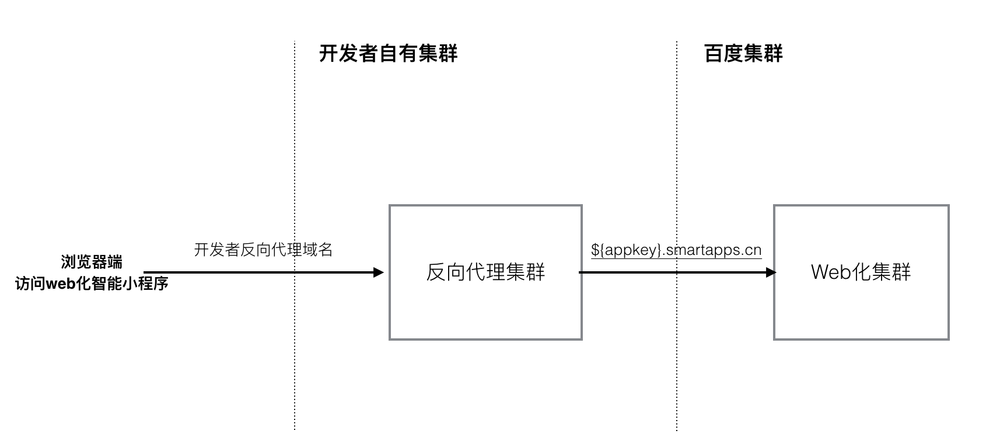

## 介绍
智能 小程序web化数据流如下图所示：

## 搭建方式
### Step1：确认自己对应的web化域名
每个web化的小程序，都会对应一个二级域名，其二级域名的格式为：
{转换后的小程序appkey值}.smartapps.cn  

由于域名不区分大小写，所以针对小程序二级域名做了转换，将大写字母改写为：小写字母加上"_"字符。

**具体转换参考下表**

| appkey | 转换后的appkey | 示例 | 
| ----- | ------ | --- |
| 4fecoAqgCIUtzIyA4FAPgoyrc4oUc25c | 4fecoa-qgc-i-u-tzi-ya-4f-a-p-goyrc4ou-c25c | http://4fecoa-qgc-i-u-tzi-ya-4f-a-p-goyrc4ou-c25c.smartapps.cn/webmapp/pages/component/component | 

### Step2：申请自己域下的域名
开发者自行申请备案。

### Step3：搭建反向代理
反向代理集群建议采用Nginx来搭建，代理时需要强制设置部分header信息，以保证能够正常转发和处理请求。
具体配置参见如下（以appkey为4fecoAqgCIUtzIyA4FAPgoyrc4oUc25c为例）：
```
    location / {
       #跨域设置
       add_header Access-Control-Allow-Origin $http_origin;
       #需要设置当前的host信息给web化服务
       proxy_set_header X-Forwarded-Host $http_host; 
       #显示设置Host为开发者自己的appkey，appkey的转换规则参见step1
       proxy_set_header Host 4fecoa-qgc-i-u-tzi-ya-4f-a-p-goyrc4ou-c25c.smartapps.cn; 
       #转发给web化服务进行处理,域名：proxy.smartapps.cn
       proxy_pass http://proxy.smartapps.cn/webmapp/;
    }
```